<style>
body{
  text-align: left;
  font-family: Nunito Sans;
  font-size: 13pt;
}

h1{
  color:#0A7BC1;
  font-weight: bold;
  font-family: Nunito Sans;
  text-decoration: underline;
}

h1.title{
  color: #0A7BC1;
  font-weight: bold;
  font-size: 42pt;
  font-family: Nunito Sans;
  text-decoration: none;
}

h2{
  font-weight: bold;
  font-family: Nunito Sans;
}

h4.date{
  text-align: left;
  font-family: Nunito Sans;
}

.no-spacing{
  font-family: Nunito Sans;
  text-align: left;
  line-height: 10pt;
}

.flex-container{
  display: flex;
  justify-content: space-between;
  align-item: flex-start;
}

.flex-image-item{
  width: 200px;
  height: 200px;
  margin: auto;
  margin-top: 15px;
}

.flex-text-item{
  font-family: Nunito Sans;
  width: 200px;
  height: 200px;
  margin: auto;
  margin-top: 15px;
  line-height: 12pt;
  font-size: 12pt;
  text-align: left;
}
</style>

```{r setup, include=FALSE}
library(knitr)
library(kableExtra)
knitr::opts_chunk$set(echo = TRUE, fig.align = 'center')
```

# About

To evaluate the functioning of the Scheldt Estuary and the activities that are held within, Flanders and The Netherlands have cooperated to develop a methodology that uses indicators to assess the state of the estuary. This evaluation is executed every six years in a cooperative action with several partners and the members of the 'Evaluation and Reporting' workgroup (PG ER) of the Flemish-Dutch Scheldt Commission (VNSC). A third installment of this evaluation is pending for T2021, which is built on the T2015 evaluation and the T2009 baseline.

Experiences in previous report have indicated that a centralized management of files and scripts, and the correct application of version control is of extreme importance to insure the readability, comprehensibility and reproducibility of the executed evaluation. Therefore, the [ScheldeMonitor](https://www.scheldemonitor.org/nl) data and information portal has been given the assignment to set up a GitHub repository, dedicated to all analysis conducted for the T2021 report. This repository is available within the [ScheldeMonitor](https://github.com/scheldemonitor) GitHub organization.

This manual was created to ensure that the usage of this repository is uniform and consistent. To achieve this, the manual contains guidelines and rules on workflow, content management and structure.

As the ScheldeMonitor information and data portal holds an RStudio environment that is intended to be used in combination with this GitHub repository, this manual is created mainly for R-users. However, multiple guidelines can also be used in other programming languages. For some sections, the content is based on the [RStudio manual](https://www.scheldemonitor.org/sites/scheldemonitor.be/files/2020-12/manual-rstudio.pdf) that is available on the ScheldeMonitor [website](https://www.scheldemonitor.org/en/data-analysis-platform). The most important sections will also be highlighted in the ‘ReadMe’ file of the repository.

# Access to the T2021 GitHub repository

## Requesting access

GitHub is a code-hosting platform for version control and collaboration that is most easily accessed through a web browser at https://github.com/. It lets users work together on projects from any location. GitHub projects are saved as ‘repositories’, being either publicly or privately visible.

The T2021 private GitHub is a private repository within the ‘ScheldeMonitor’ GitHub organization. This implies that organization is visible in GitHub (https://github.com/scheldemonitor), yet the repository is hidden from non-members.

```{r echo=FALSE, out.width='80%'}
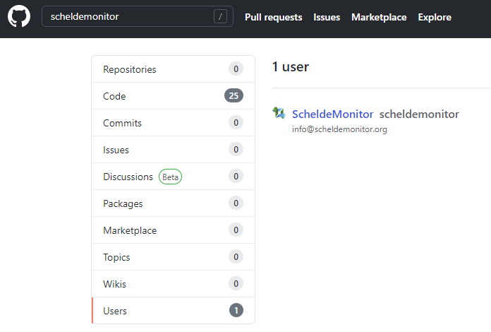
```

```{r echo=FALSE, out.width='80%'}
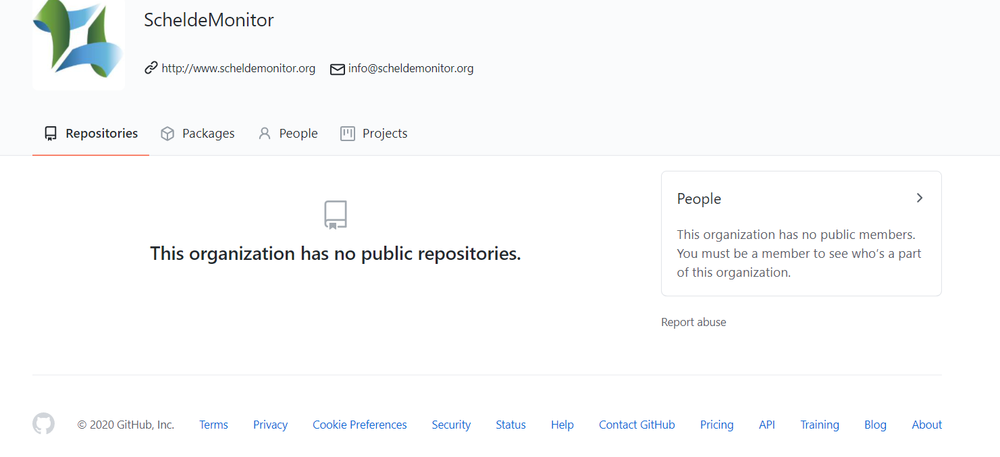
```

Researchers, members of the VNSC or their working groups, and partners institutes of the ScheldeMonitor can request access to the ScheldeMonitor GitHub organization, or to one specific public or private repository.

To do so, users can send an email to info@scheldemonitor.org with topic ‘ScheldeMonitor GitHub’, and answers to the following questions:

- Name and GitHub username?
- Are you a member of the VNSC or one of the working groups?
- Do you want access to specific repositories, and for what reason?
- What institute are you affiliated with?
- Do you need a specific level of clearance (see [Rules for the GitHub repository of T2021](#rules_for_the_gihub_repository_of_T2021))?

## Access management

With the given information, the helpdesk of ScheldeMonitor will check whether the user can be granted access or not. This implies that the user is designated with two separate ‘roles’, one within the ‘ScheldeMonitor’ GitHub organization and one within a chosen repository, each granting a different set of rights.

### Organization access

When eligible for membership within the ScheldeMonitor GitHub organization, a user can be granted either ‘owner’ or ‘member’ status. If not, the user is considered as an ‘outside collaborator’ and will only gain access to chosen repositories within the organization. By default, the helpdesk of ScheldeMonitor and the VNSC are considered as owners of the organization. The differences between the owner, member or outside collaborator status is given in the tables below:

```{r organization access table Visibility, echo=FALSE}
data_visibilityTable <- data.frame(
  Visibility = c("See organization", "See public repositories", "See private repositories", "See members","Change repository visibility"),
  Owner = c("X", "X", "X", "X", "X"),
  Member = c("X", "X", "X", "X", ""),
  Outside_collaborator = c("X", "X", "", "X", "")
)
kable(data_visibilityTable, col.names=c("Visibility", "Owner", "Member", "Outside collaborator"), align='l', booktaps=TRUE)%>%
  kable_styling(latex_options = "striped", full_width = FALSE, position = 'c')%>%
  column_spec(1, bold = TRUE)
```

```{r organization access table Management, echo=FALSE}
data_managementTable <- data.frame(
  Management = c("Manage members", "Manage collaborators", "Create public repository", "Create private repository","Delete repositories", "Transfer repositories"),
  Owner = c("X", "X", "X", "X", "X", "X"),
  Member = c("", "", "", "", "", ""),
  Outside_collaborator = c("", "", "", "", "", "")
)
kable(data_managementTable, col.names=c("Management", "Owner", "Member", "Outside collaborator"), align='l', booktaps=TRUE)%>%
  kable_styling(latex_options = "striped", full_width = FALSE, position = 'c')%>%
  column_spec(1, bold = TRUE)
```

```{r organization access table Base repository rights, echo=FALSE}
data_baserepositoryrightsTable <- data.frame(
  BaseRepositoryRights = c("Clone any repository", "Pull any repository", "Push/merge any repository", "Branch public repositories","Branch private repositories"),
  Owner = c("X", "X", "X", "X", "X"),
  Member = c("X", "X", "", "X", ""),
  Outside_collaborator = c("", "", "", "", "")
)
kable(data_baserepositoryrightsTable, col.names=c("Base repository rights", "Owner", "Member", "Outside collaborator"), align='l', booktaps=TRUE)%>%
  kable_styling(latex_options = "striped", full_width = FALSE, position = 'c')%>%
  column_spec(1, bold = TRUE)
```

```{r organization access table Interaction, echo=FALSE}
data_interactionTable <- data.frame(
  Management = c("Create discussions", "Comment discussions", "Delete issues", "Create teams","Manage teams", "Publish GitHub Pages sites"),
  Owner = c("X", "X", "X", "X", "X", "X"),
  Member = c("X", "X", "X", "X", "X", "X"),
  Outside_collaborator = c("", "", "", "", "", "")
)
kable(data_interactionTable, col.names=c("Interaction", "Owner", "Member", "Outside collaborator"), align='l', booktaps=TRUE)%>%
  kable_styling(latex_options = "striped", full_width = FALSE, position = 'c')%>%
  column_spec(1, bold = TRUE)
```

Members can be added to certain teams within the organization as well. Using teams allows for internal discussion, team mentions and assignments, as well as the addition of complete teams to certain repositories instead of individual members and collaborators. These teams can be created per partner institute or in favor of certain working groups of the VNSC.

```{r echo=FALSE, out.width='90%'}
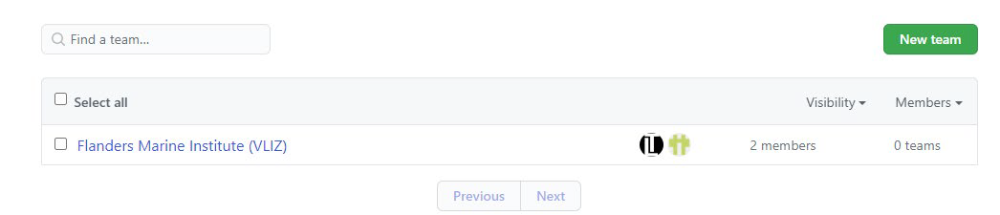
```

### Repository access

Although organization members have base reading rights, it is still necessary to assign users to repositories as collaborators to grant repository-specific rights. These rights overrule the base rights established on the organization level, implying that outside collaborators can receive reading and writing rights for a specific repository without having to be a member of the organization. The different roles for a repository, and their specific rights, are given in the table below:

```{r repository access table, echo=FALSE}
data_repositoryAccessTable <- data.frame(
  actions = c("Pull repository", "Branch repository", "Clone repository", "Comment","Manage issues", "Apply labels", "Manage labels", "Push/merge repository", "Manage comments", "Change repository visibility", "Change repository settings", "Manage collaborators"),
  Read = c("X", "X", "X", "X", "X", "", "", "", "", "", "", ""),
  Triage = c("X", "X", "X", "X", "X", "X", "", "", "", "", "", ""),
  Write = c("X", "X", "X", "X", "X", "X", "X", "X", "X", "", "", ""),
  Maintain = c("X", "X", "X", "X", "X", "X", "X", "X", "X", "", "", ""),
  Admin = c("X", "X", "X", "X", "X", "X", "X", "X", "X", "X", "X", "X")
)
kable(data_repositoryAccessTable, col.names=c("", "Read", "Triage", "Write", "Maintain", "Admin"), align='l', booktaps=TRUE)%>%
  kable_styling(latex_options = "striped", full_width = FALSE, position = 'c')%>%
  column_spec(1, bold = TRUE)
```

By default, contributors are going to receive “Write” status to be able to work on new developments within a repository. The ScheldeMonitor helpdesk, as well as the project leaders, will be designated as “Admin” status to be able to manage the contributions made to the repository.

# Working with a GitHub repository

The T2021 repository can be seen as a ‘master folder’, where everything associated with this specific project should be kept. Repositories, or ‘repo’s’, can have folders within them, or just consist of separate files.

Having a GitHub repo makes it easy for users to keep track of collaborative and personal projects, as all files necessary for certain analyses can be held together and people can add in their code, graphs, etc. as the projects develop. Each file on GitHub has a history, making it easy to explore the changes that occurred to it at different time points. You can review other people’s code, add comments to certain lines or to the overall document, and suggest changes.

For collaborative projects, GitHub allows you to assign tasks to different users, making it clear who is responsible for which part of the analysis. You can also ask certain users to review your code. For personal projects, version control allows you to keep track of your work and easily navigate among the many versions of the files you create, whilst also maintaining an online backup.

This chapter describes how to start using the GitHub repository to assemble all scripts, documents and data files that are used to compose the T2021 report of the Scheldt estuary.

## Installation of Git

First, an installation of Git is needed on the personal hardware of the user, in orde to grant the functions that are necessary for version control. This installation differs between Windows and Mac hardware.

### Windows

If a user is on Windows hardware, download and install Git (https://git-scm.com/downloads) for your operating system. Below are some recommended installation instructions:

|      _For “Select Components”, check:_

- _“Git Bash Here”_
- _“Git GUI Here”_
- _“Git LFS (Large File Support)”_
- _“Associate .git* …”_
- _“Associate .sh …”_

|      _When prompted to choose the default editor, select Nano (a simple terminal editor) or Notepad++ (a simple graphical editor):_
|      _For “Adjust your PATH environment”, select: “Use Git from Git Bash only”_
|      _For “Choose HTTPS transport backend”, select: “Use the OpenSSL library”_
|      _For “Configure the line ending conversions”, select: “Checkout Windows-style,…”_
|      _For “Configure the terminal emulator …”, select: “Use MinTTY …”_
|      _For “Configure extra options”, select: “Enable file system caching”_
|      _“Enable Git Credential Manager”_

### Mac

If a user is on Mac software, install Git via Homebrew, which is a package manager for command line programs on Mac. First, open a terminal, which can be found at ~/Application/Utilities/Terminal.app. Then, copy and paste this line into the terminal and hit “Enter”:

|      _/usr/bin/ruby -e "$(curl –fsSL https://raw.GitHUBusercontent.com/Homebrew/install/master/install)"_

Now enter the following to install Git:

|      _brew install git_

Follow any instructions in the terminal window, the user may need to enter a Mac’s password or agree to questions by typing “yes”.

Now that Git is installed, the user can start using version control for both the internal projects as well as with GitHub repositories.

## Using version control with GitHub & RStudio

The GitHub workflow can be summarized by the “pull-commit-push” mantra. Using this methodology, each file on GitHub has a history. So instead of having many files like scripts_1st_May.R, script_2nd_May.R, the user can have only one. By exploring its history, the user can see what it looked like at different points in time.

As it is intended to use the T2021 repository in combination with the RStudio environment of ScheldeMonitor, it is important to make a connection between the repository and RStudio. How to do so is described in detail in the [RStudio manual](https://www.scheldemonitor.org/sites/scheldemonitor.be/files/2020-12/manual-rstudio.pdf), available in the GitHub repository or on the [ScheldeMonitor](https://www.scheldemonitor.org/en/data-analysis-platform) website.

Once connected, all work in the RStudio environment can be done in a version-controlled manner. The workflow to do so is described by the five steps below:

### Create a new project branch

Working on projects is done in ‘branches’. A branch is a copy, or version, of the project repository in which edits can be made. Every project starts with the default ‘master’ branch. This branch should be treated as a red line throughout the project and end in the finalized product. Therefore, the number of direct edits to the master branch should be limited. To initiate new developments, new branches can be made that are dedicated to those specific developments. Using this methodology, several developments can be initiated aside one another, without affecting each other or the default master branch:

```{r echo=FALSE, out.width='60%'}
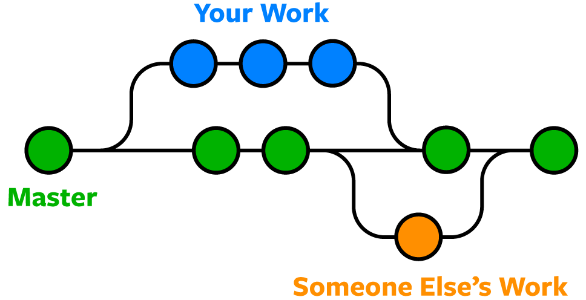
```

Creating a new branch can be done most easily in the GitHub project repository online. When on the project webpage, the currently visualized branch is indicated above the repository:

```{r echo=FALSE, out.width='90%'}
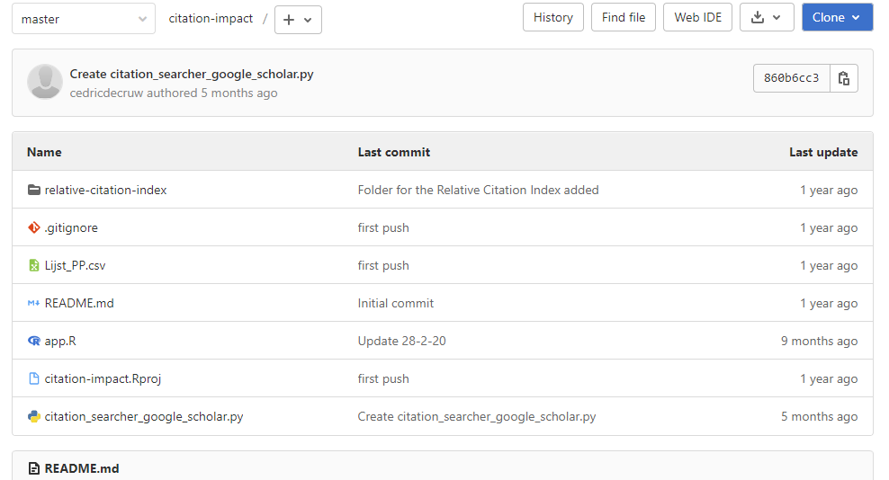
```

By default, the ‘master’ branch is chosen. Different branches can be chosen through the dropdown menu. To initiate a new branch, the ‘+’ icon can be used to choose the ‘New Branch’ option for the repository:

```{r echo=FALSE, out.width='90%'}
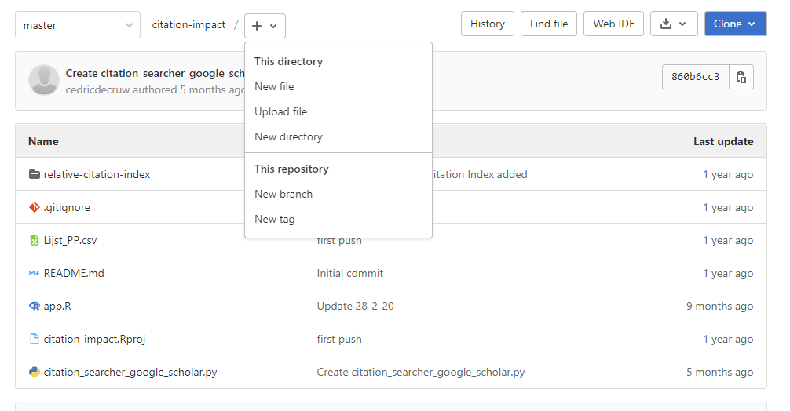
```

In doing so, the system will ask to name the branch and to choose from which existing branch a new branch needs to be created (e.g. which existing branch needs to be copied). It is imperative to name branches clearly, so other users have a clear idea of why the branch was created in the first place. This is further explained in this manual, in the section [‘Branch nomenclature’](#creating_branches).

When the used RStudio instance is connected with GitHub (as explained in the ScheldeMonitor [RStudio Manual](https://www.scheldemonitor.org/sites/scheldemonitor.be/files/2020-12/manual-rstudio.pdf)), a ‘Git’ tab appears in the environment frame of the RStudio workspace where the user can choose in which branch edits are being made:

```{r echo=FALSE, out.width='70%'}
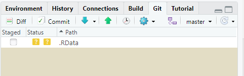
```

Once a new branch has been created, or the right branch has been selected, editing the files and scripts can commence. While doing this, version control can be managed in the same window as shown above, using the actions discussed hereafter.

### Pull a repository to RStudio

Before commencing work on the repository, the user should make sure that the latest version of the chosen branch is available. To get this, the branch should be downloaded or ‘pulled’ from the online repository. This option is given in the ‘Git’ tab in the environment panel of the workspace, and is marked with a blue arrow:

```{r echo=FALSE, out.width='70%'}
knitr::include_graphics("./images_manual_GitHub/image8_rstudio_pull_repository.png")
```

Clicking the icon will start a ‘pull’ of the indicated branch and will make a new window appear in which the progress of the action is indicated. This action can be done anytime the user wants to. If the workspace is already up to date, this will be indicated in the progress window:

```{r echo=FALSE, out.width='80%'}
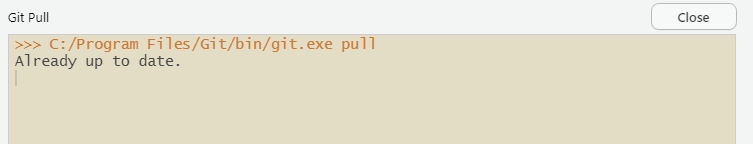
```

### Make changes and commit

After a pull, the user can start to make changes to the files in the given branch of the repository. Once done, the changes need to be saved or ‘committed’ within the local version of the branch. To do so, the user can select the ‘Commit’ button in the ‘Git’ tab.

```{r echo=FALSE, out.width='70%'}
knitr::include_graphics("./images_manual_GitHub/image10_rstudio_commit_button.png")
```

This will provide a new window where the user selects which files need to be committed. Generally, all files are selected. For each file, the window indicates what changes were made, with additions colored green and removals colored red.

```{r echo=FALSE, out.width='90%'}
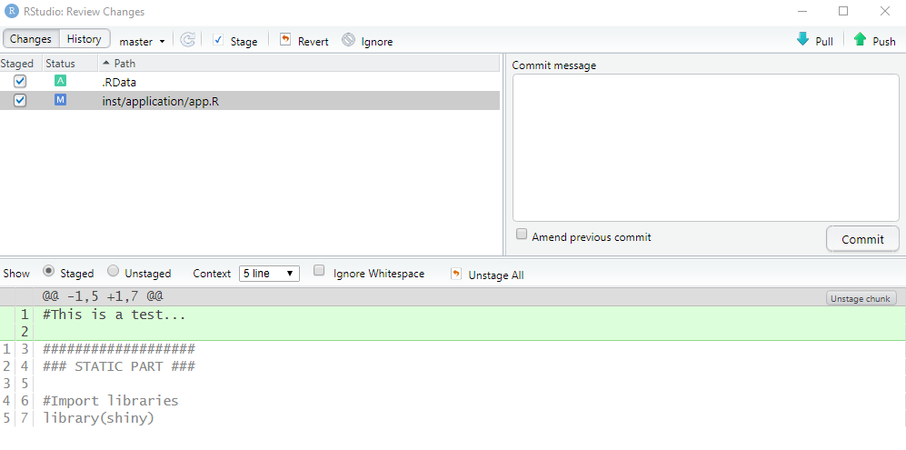
```

Once everything is as it should be, the commit can be finalized, by including a ‘Commit message’ and pressing the ‘Commit’ button. A message is mandatory in order to be able to commit changes, and should state the reason the commit was executed. This should thus not be a literal description of the code added or removed. For instance, in the example above, the message should state _‘Testing commit procedure for manual’_.

When done correctly, a third window that displays the progress of the executed commit will appear. If no issues were found, the bottom statement will indicate how many files were changed and in what way:

```{r echo=FALSE, out.width='90%'}
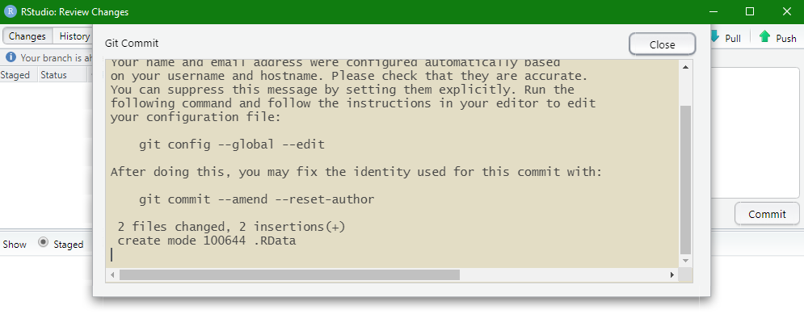
```

### Push changes to the online repository

If a user has committed all changes, it is important to let colleagues now that these changes have been made to the files in this specific branch. To do so, all alterations in the local repository need to be uploaded or ‘pushed’ to the online repository. This is the direct opposite of the ‘pull’ action explained beforehand. It is strongly recommended to first perform a ‘pull’ of the repository, to make sure that the user’s changes will be uploaded to the newest version of the online repository. Afterwards the ‘push’ action can be commenced from the same ‘Git’ tab.

When using the green arrow, a progress window appears that states if the push was done successfully or whether issues emerged.

```{r echo=FALSE, out.width='80%'}
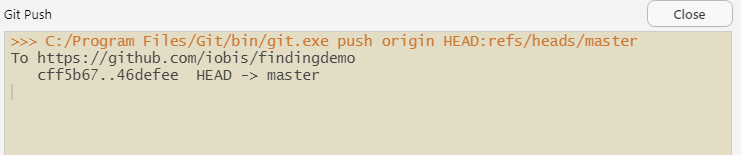
```

It is common that when performing a push for the first time, an error occurs stating “fatal: Authentication Failed”. This implies that the user’s credentials were not valid to access the repository online. To remedy this issue, the user should first login using the web browser on https://github.com/. Alternatively, credentials can be managed using the credential manager of the user’s hardware.

### Merge branches

When a branch has completed the achieved development, the changes should be applied back to the parent branch for implementation in the main feature line. To do so, branches are ‘merged’ or combined together. In this case, Git will find two commit pointers, usually the branch tips, with a common base commit between them. Once this common base is found, Git will execute a ‘merge commit’ that combines the changes within each branch as shown below:

```{r echo=FALSE, out.width='80%'}
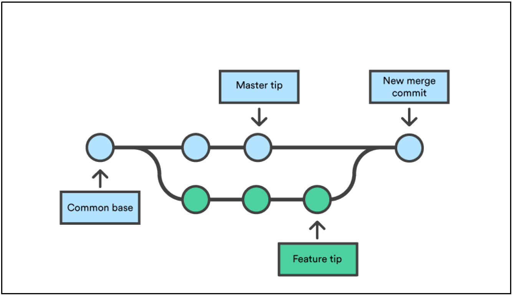
```

Merging branches is most commonly done from the online repository on https://github.com/. When accessing the tab ‘Pull requests’, a new merge can be initialized with the ‘New pull request’ button.

```{r echo=FALSE, out.width='90%'}
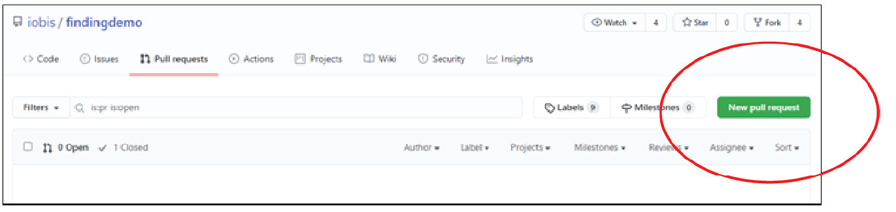
```

In the following window, a base and to-be-compared branch need to be selected. The base branch is the parent branch to which the other branch will be merged. Before creating the pull request, a description can be added of what has changed in comparison with the base branch:

```{r echo=FALSE, out.width='80%'}
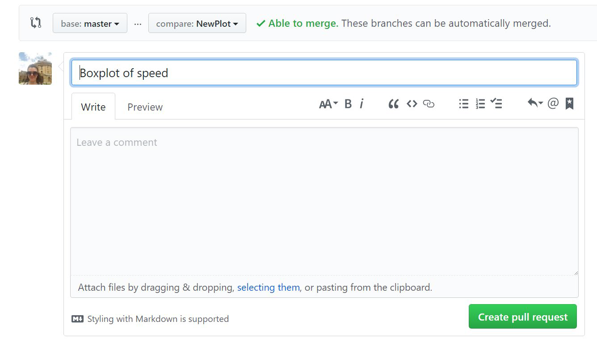
```

Once the request is created, GitHub will compare the two branches of the project. If there are no overlapping or conflicting changes, GitHub will indicate that the branches can be merged directly:

```{r echo=FALSE, out.width='80%'}
knitr::include_graphics("./images_manual_GitHub/image17_merge_pull_request.png")
```

If this is the case, the child branch can be deleted safely if needed. However, it is possible that there is a conflict. In this case, this will also be indicated by GitHub, and needs to be resolved using the ‘Resolve conflicts’ button before a merge is possible:

```{r echo=FALSE, out.width='80%'}
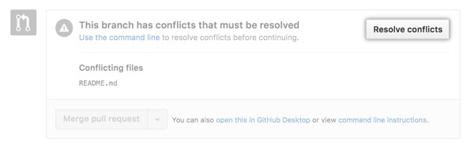
```

If this button is deactivated, the conflicts are too extensive to be resolved in GitHub. Otherwise, a new window will popup indicating which files and which sections generate the conflicts. At this point, it needs to be decided whether the user wants to keep the parent branch version, the child branch version, or make a brand new change that incorporates changes from both branches:

```{r echo=FALSE, out.width='90%'}
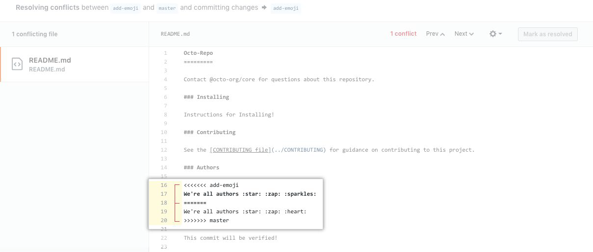
```

Once all issues in a file are resolved, click ‘Mark as resolved’ for that file:

```{r echo=FALSE, out.width='90%'}
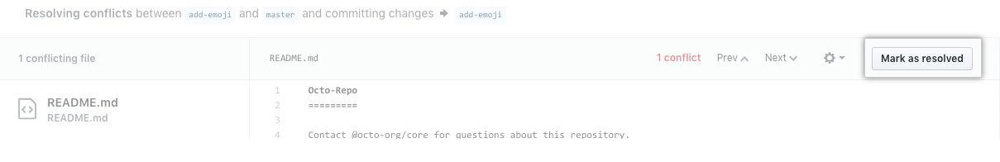
```

If all conflicts in all files have been resolved, the merge can be executed with the ‘Commit merge’ button:

```{r echo=FALSE, out.width='90%'}
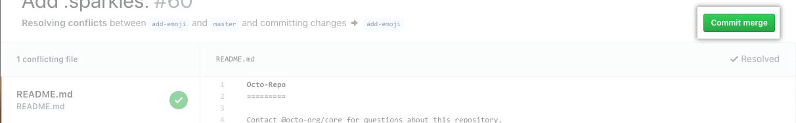
```

### Version tracking

All commits that are executed in a GitHub repository are tracked throughout the project. That way, users can explore past versions of folders and files to see what has changed. To do so, a user can access the history of every chosen file or folder, or even the whole repository:

```{r echo=FALSE, out.width='90%'}
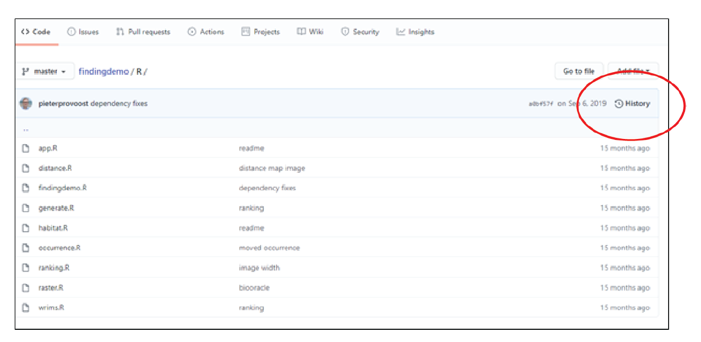
```

This history will give an overview of all executed commits. The exact changes within each commit can be displayed by clicking on a certain commit:

```{r echo=FALSE, out.width='90%'}
knitr::include_graphics("./images_manual_GitHub/image23_history2.png")
```

## Rules for the GitHub repository of T2021

### Creating branches

In the section [Create a new project branch](#create_a_new_project_branch), it is explained that working in branches is necessary to make new developments within a GitHub project. As the T2021 GitHub repository is part of a basic billing plan, all contributors can create a new branch within the repository. Therefore, it is key to keep a clear image of why branches are made. Nomenclature is an important aspect here.

Although branch nomenclature is often repository- or project specific, there are three ground rules to be followed:

1. The branch name should contain a short, actionable description of what the development is about.

2. If a branch is created to deal with an issue, add the issue tracker ID to the branch name.

3. Use hyphens (“-“) as separators.

```{r echo=FALSE, out.width='80%'}
knitr::include_graphics("./images_manual_GitHub/image24_branch_naming_convention.png")
```

### Creating folders

The folder structure of the T2021 GitHub repository is based on the intended chapters of the accompanying publication, as was the case for the T2015 data archive. This consists of eight main folders, each containing multiple subfolders. This main structure should only be altered in agreement with the administrators of the repository.

```{r echo=FALSE, out.width='90%'}
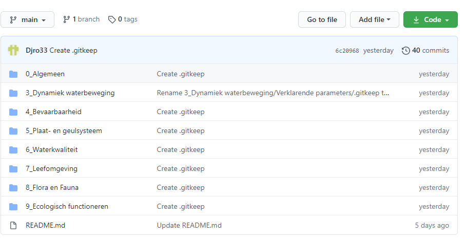
```

```{r echo=FALSE, out.width='90%'}
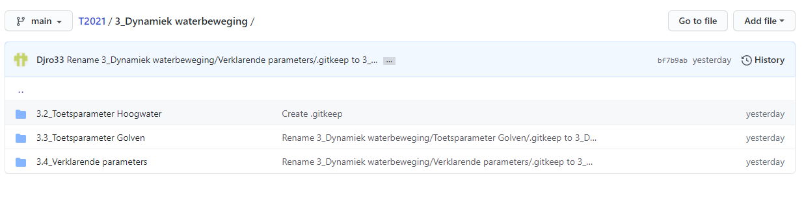
```

Data files and scripts that are related to a certain chapter should be stored within the designated folder. To do so, a clear and uniform methodology should be used. Typically, data files and scripts should be saved in separate folders. Although it might seem more convenient to keep those files together, the general overview benefits from the two-folder structure. Scripts and data files often do not have a 1:1 relationship, as a single script can use multiple data files while these data files are run through multiple different scripts. However, the structure of each folder should be the same, with a folder for every phase of the project:

```{r echo=FALSE, out.width='50%'}
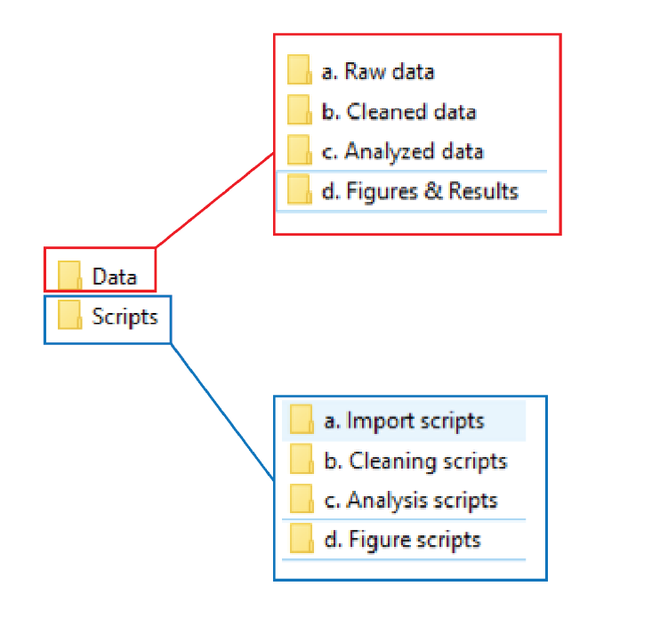
```

Using this structure, a uniform workflow can be established within the project directory. This workflow follows four fixed steps, that are explained using the following table:

```{r workflow table, echo=FALSE}
data_workflowTable <- data.frame(
  Step = c("Step 1 - Import data (if necessary)", "Step 2 - Clean data", "Step 3 - Anayze data", "Step 4 - Create figures or results"),
  UsingDataFrom = c("n/a", "'a. Raw data'", "'b. Cleaned data'", "'c. Analyzed data'"),
  UsingScriptsOrFunctionFrom = c("'a. Import scripts'", "'b. Cleaning scripts'", "'c. Analysis scripts'", "'d. Figure scripts'"),
  SavingNewDataOrResultsIn = c("'a. Raw data'", "'b. Cleaned data'", "'c. Analyzed data'", "'d. Figures & Results'")
)
kable(data_workflowTable, col.names=c("", "Using data from:", "Using scripts or functions from:", "Saving new data or results in:"), align='l', booktaps=TRUE)%>%
  kable_styling(latex_options = "striped", full_width = FALSE, position = 'c')%>%
  column_spec(1, bold = TRUE)
```


More information on bringing structure to folders, files, scripts and code can be found within the [RStudio Manual](https://www.scheldemonitor.org/sites/scheldemonitor.be/files/2020-12/manual-rstudio.pdf) of ScheldeMonitor.

Creating or moving a folder within GitHub can be done by creating or editing a file within that specific folder. When doing so, the window below appears that allows users to change the filename. Besides changing the filename, this also allows users to create folders by typing ‘/’ after the name, turning it from a filename to a foldername. This way, folders can be created, moved or deleted:

```{r echo=FALSE, out.width='80%'}
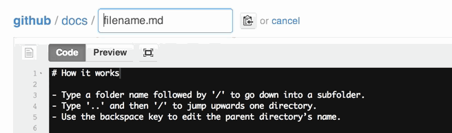
```

Importantly, GitHub doesn’t allow creation of empty folders. Therefore, if this is intended by the user, a ‘.gitkeep’ file should be added inside the newly created folder to tell the system the folder should be kept.

```{r echo=FALSE, out.width='80%'}
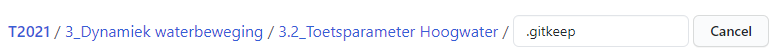
```

### Creating files

Files should be named in such a way that users can easily derive their purpose. This is especially important when working with scripts that source functions from other scripts throughout the different phases of the code.

For example, when using different scripts for different kinds of graphs, the nomenclature should clearly indicate which plot is made using the script. Additionally, if the work in the RStudio environment is linked to a certain report or publication, the figure number from the publication could be inserted in the file name. It is also possible that multiple scripts are used for the same figure, in which case nomenclature should show the discrepancies between the scripts. These rules can result in following nomenclature:

```{r echo=FALSE, out.width='50%'}
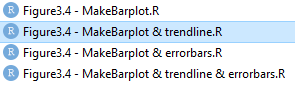
```

More information on this topic, as well as a description of the most commonly used naming conventions, can be found in the [RStudio guide](https://www.scheldemonitor.org/sites/scheldemonitor.be/files/2020-12/manual-rstudio.pdf) on the ScheldeMonitor [website](https://www.scheldemonitor.org/en/data-analysis-platform).

### Creating code

Cooperating with multiple users in this GitHub repository demands readability and reproducibility of code. Therefore, it is important to use guidelines and apply structure to your code, whether it being the R or Python programming language.

As mentioned in the introduction, this manual focuses mostly on R, as it intends the combined use of the GitHub repository with the ScheldeMonitor RStudio environment. For R, there is no clear consensus on best practices. However, the [RStudio manual](https://www.scheldemonitor.org/sites/scheldemonitor.be/files/2020-12/manual-rstudio.pdf) on the ScheldeMonitor [website](https://www.scheldemonitor.org/en/data-analysis-platform) provides an extensive overview on common guidelines for:

- Hardcoding
- Spacing
- Code blocks
- Long lines of code
- Use of pipes

The most important aspects that can be applied to all programming languages are the application of structure and annotations. Structure in coding makes an extensive script more readable and comprehensible. For this manual, the following structure is suggested:

-  Who, when, what and how: This is a large heading that should start every script in your project, stating who wrote the script, when it was written, how to contact the writer and what its purpose is.
- 0 – Load libraries: In this section all libraries are listed that need to be loaded before running the whole script. This section can also give some further explanation on the use of those libraries.
- 1 – Static part: In this part, all static actions are taken such as loading in data files, preparing those data files for analysis, sourcing other scripts and functions or naming arguments that will be used later on in the script.
- 2 – Script: This section contains the actual code that makes the script fulfill its purpose.

```{r example script structure, eval=FALSE}
#################################################################################
## This is an example for the manual
##
## written by Jelle Rondelez of VLIZ
## info@scheldemonitor.org - Oct 2020
#################################################################################

##############################
# 0 - Load libraries
##############################
library(dplyr) # package to clean datatable
library(lubridate) # package to change date formats

##############################
# 1 - Static part
##############################

#Assign variable
newvar <- ""

#Source script from within directory
source("Scripts/a. Import scripts/ImportsWFS")

#open data file
datafile <- read.csv(file = "Data/b. Cleaned data/dataRWS.csv")

##############################
# 2 - Scripts
##############################
code...
```

Annotating code is important for a number of reasons. It helps to explain in detail what a line, chunk or even section of code is trying to accomplish. This is helpful for the user, or other people who read the code.

Annotating code is done with the symbol # (hashtag), situated above a whole chunk of code, like when explaining the purpose of a certain function.

```{r example script annotation, eval=FALSE}
#Reactive values for user location
data_of_click <- reactiveValues(clicked = NULL)
longitude_click <- reactiveValues (lng = NULL)
latitude_click <- reactiveVaules (lat = NULL)

#If user clicks on map, new coordinates are saved and map is adjusted
observeEvent(input$Map_click. {
  data_of_click$clicked <- input$Map_click
  longitude_click <- input$Map_click$lng
  latitude_click <- input$Map_click$lat
  leafletProxy('Map')%>%
    clearMarkers()%>%
    addMarkers(lng = input$Map_click$lng,
               lat = input$Map_click$lat,
               popup = paste("Longitude=", round(input$Map_click$lng,2), "and",))
})
```

# Helpdesk

VLIZ is responsible to manage the GitHub organization of ScheldeMonitor. This implies management of the organization settings, its content and all contributors. The GitHub organization is intended as the central hub for all repositories dedicated to research and analysis built on ScheldeMonitor data and information, and projects funded by the VNSC.

To manage these and other needs of users and contributors, VLIZ will have a permanent helpdesk. This helpdesk can be contacted through the general address of the ScheldeMonitor:

**Helpdesk ScheldeMonitor**

Data Centre - Local Services & Projects

:::: {class="flex-container"}

::: {class="flex-image-item"}

```{r, echo=FALSE}
knitr::include_graphics("./images_manual_GitHub/VLIZ_logo_positief.png")
```

:::

::: {class="flex-text-item"}

**Vlaams Instituut voor de Zee vzw**

**Flanders Marine Institute**

InnovOcean site, Wandelaarkaai 7

8400 Oostende, Belgium

:::

::: {class="flex-text-item"}

T +32(0)59340172

info@scheldemonitor.org

[www.vliz.be](www.vliz.be)

:::

::::

For urgent matters or questions, or if users and contributors want to discuss the use of the GitHub organization for certain projects, the project manager of ScheldeMonitor should be contacted:

**Jelle Rondelez**

::: {class="no-spacing"}

Project Manager

Data Centre - Local Services & Projects

:::

:::: {class="flex-container"}

::: {class="flex-image-item"}

```{r, echo=FALSE}
knitr::include_graphics("./images_manual_GitHub/VLIZ_logo_positief.png")
```

:::

::: {class="flex-text-item"}

**Vlaams Instituut voor de Zee vzw**

**Flanders Marine Institute**

InnovOcean site, Wandelaarkaai 7

8400 Oostende, Belgium

:::

::: {class="flex-text-item"}

M +32(0)473510828

jelle.rondelez@vliz.be

[www.vliz.be](www.vliz.be)

:::

::::
