```{r setup, include=FALSE}
library(knitr)
library(kableExtra)
knitr::opts_chunk$set(echo = TRUE, fig.align = 'center')
```

# About

This document was written as a manual on the use of the online RStudio environment of the ScheldeMonitor information and data portal. This environment has been accessible through the ScheldeMonitor website since 2021. It provides accredited researchers and the partners of ScheldeMonitor with a centralized RStudio hub to do analysis and build up scripts directly based on the data and information that is held within the portal and the underlying database.

Within the manual, guidelines are provided for new users or users that are inexperienced in the use of RStudio, as well as some overall recommendations on how to keep work in RStudio structurized and comprehensible. The last chapter of this manual also provides a step-by-step breakdown on how to load data from ScheldeMonitor into the RStudio workspace.

The RStudio environment can be accessed from the website, using the following [link](https://www.scheldemonitor.org/en/data-analysis-platform). To access, credentials are required. These credentials can be requested [here](https://rshiny.lifewatch.be/account?p=register), or by sending a mail to info@scheldemonitor.org with a statement on the reason why use of the RStudio environment is required.

It is also possible to link the RStudio environment with an existing project from the ScheldeMonitor GitHub organization. How to work with GitHub in relation with RStudio, is discussed in an additional RStudio [manual](https://www.scheldemonitor.org/sites/scheldemonitor.be/files/2020-12/manual-github.pdf).

# Connecting to the RStudio environment of ScheldeMonitor

The ScheldeMonitor environment can be accessed at (https://rstudio.scheldemonitor.org/auth-sign-in) using your personal credentials:

```{r echo=FALSE}
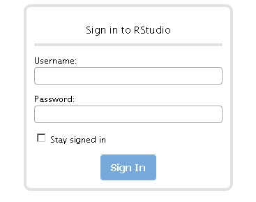
```

These credentials are similar to those used for all other tools within the ScheldeMonitor platform, such as the data download toolbox and the E-room. 

New users should first register to receive their personal credentials. This can be done using this [link](https://rshiny.lifewatch.be/account?p=register) or by contacting the [helpdesk](#helpdesk) of ScheldeMonitor stating the reason to use the RStudio environment.

The following information is needed to register on the RStudio environment of ScheldeMonitor:

```{r echo=FALSE, out.width='90%'}
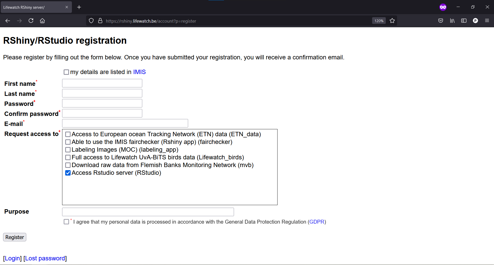
```

After registration, your account needs to be approved by a moderator of the ScheldeMonitor RStudio environment. This process can take one or two working days.

```{r echo=FALSE, out.width='60%'}
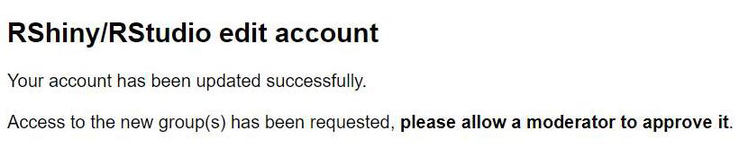
```

After approval, you can use your personal credentials to sign in to the RStudio environment of ScheldeMonitor.

Once logged in, you will see your personal workspace in RStudio. This workspace can either be cleaned (for instance if you are a new user) or show the structure and content that was worked on during your previous session if you saved the workspace image on the last closure.

A personal workspace is standardly composed of four windows, showing scripts or dataframes, your environment, the console, and your project or personal file structure. It also indicates which user is logged in and which project is linked to your workspace:

```{r echo=FALSE}
knitr::include_graphics("./images_manual_rstudio/image2_rstudio_workframe.png")
```

# Working with the RStudio environment of ScheldeMonitor

## Guidelines for workspace

The default behaviour of R for the handling of .RData files and workspaces encourages and facilitates a model of breaking work contexts into distinct working directories. This implies that the user can select a certain folder in his local directory to use as the location where files, handled through RStudio, are saved. This local directory, or workspace, can be altered at any given moment by the user.

In version v0.95 of RStudio, a new ‘Projects’ feature was introduced to make managing multiple working directories more straightforward. It is recommended to use this feature, however this chapter also explains how to handle your workspaces in the default manner.

As with a local RStudio installation, the online RStudio environment of ScheldeMonitor uses the local user’s home directory as workspace by default. This workspace is typically referenced using ~ in R. When RStudio starts up it does the following:

- Executes the .Rprofile (if any) from the default working directory.
- Loads the .RData file (if any) from the default working directory into the workspace.
- Performs the other actions described in R Startup.

When RStudio exits and changes to the workspace have been made, a dialog box asks whether these changes should be saved to the .RData file in the current working directory. Clicking “Save” will ensure that your changes are stored and will appear as they were the next time you login to the RStudio environment.

### Set a workspace

RStudio displays the current working directory within the title region of the Console. To check your current working directory, you can run the command getwd() in the RStudio console:

```{r}
getwd()
```

To change the working directory, you can run the command setwd() in the RStudio console with the new directory inserted as a string:

```{r eval=FALSE}
setwd("//fs/HOME/jeller")
```

You can also change the working directory by selecting the “Tools” menu and “Change Working Directory”. For users with Mac, this is found in the “Session” menu and the “Set Working Directory”.
Be careful to consider the side effects of changing your working directory:

- Relative file references in your code (for data sets, source files, etc.) will become invalid when you change working directories.
- The location where .RData is saved at exit will be changed to the new directory.

Because these side effects can cause confusion and errors, it is usually best to start within the working directory associated with your project and remain there for the duration of your session.

The best practice, however, is to connect the RStudio environment to a certain ‘project’. This allows for a better oversight on the working directories and different cases you work on within the same RStudio environment. The next segments describe how such projects are instigated.

### Start a local project

Any approved user can utilize the RStudio environment to commence or continue his or her personal project with the data of ScheldeMonitor. Doing so, users can either start a new local project, download an existing project from their own GitHub, or connect their work to the GitHub organization of ScheldeMonitor.

Starting a local project is the easiest way to commence your work. This project is saved on a local drive of the user’s hardware, and can only be restarted by accessing that drive. To initiate such a local project, users need to follow the following steps:

1. Open the “File” menu and select “New Project”.

```{r, echo=FALSE, out.width='50%'}
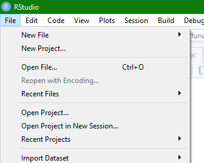
```

2. In the New Project Wizard, select “New Directory”. This will start a new project that will be saved on the local drive of the user’s hardware.

```{r, echo=FALSE, out.width='50%'}
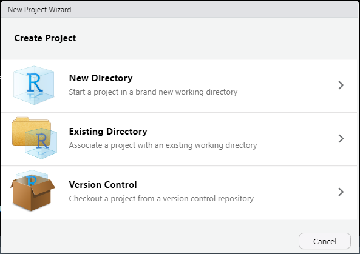
```

3. The user can now choose which type of project needs to be started

    - New Project: Basic R project where all kind of scripts can be set up.
    - R Package: Project where users can make and publish dedicated R packages for other users.
    - Shiny Web Application: R project where all scripts are premade for users to create and run Shiny web applications.
    
```{r, echo=FALSE, out.width='60%'}
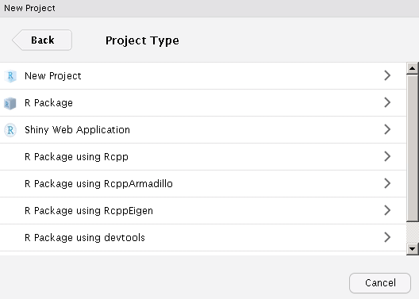
```

4. Lastly, the user can name the project and select the directory in which the project will create a subdirectory. Selecting the option “create a git repository” will allow the user to use locally installed version control. This option is not needed when working with an online GitHub space.

```{r echo=FALSE, out.width='60%'}
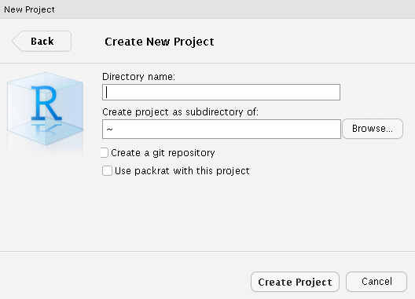
```

### Set up an existing GitHub project

If a project needs to be user-controlled and accessible by multiple users, it is best practice to create a repository on GitHub. Setting up a personal GitHub repository is beyond the scope of this manual. However, as ScheldeMonitor has created a GitHub organization, a dedicated manual on the use of GitHub is available on the [website](https://www.scheldemonitor.org/en/data-analysis-platform).

To connect your personal space of the RStudio environment on ScheldeMonitor to a known GitHub repository, the following steps need to be taken:

1. Open the “File” menu and select “New Project”.

```{r echo=FALSE, out.width='50%'}

```

2. In the New Project Wizard, select the option “Version Control”.

```{r echo=FALSE, out.width='60%'}

```

3. Next, select “Git” as this is the version controlled methodology used within the context of ScheldeMonitor.

```{r echo=FALSE, out.width='60%'}
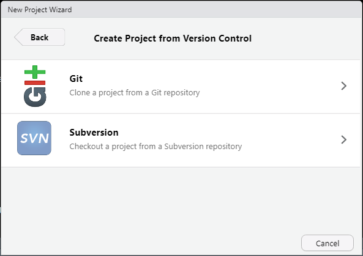
```

4. To establish a connection between your personal RStudio environment and the GitHub repository, the system needs to know from which online space the repository can be downloaded. This URL matches the online repository on https://github.com/. Additionally, the system needs a local directory to store the downloaded files, or to hold up the files that have not been uploaded back to the repository yet.

```{r echo=FALSE, out.width='60%'}
knitr::include_graphics("./images_manual_rstudio/image8_rstudio_new_project_wizard_clone_git_repository.png")
```

## Connect the RStudio environment of ScheldeMonitor to GitHub using SSH authentication

### Disclaimer

This manual was written for the users of the online [RStudio environment of ScheldeMonitor](https://rstudio.scheldemonitor.org/auth-sign-in). The procedure and affiliated scripts have been deployed on the server of this environment, so that users do not need to install anything to execute the procedure. This implies that this procedure will not work on other (local) RStudio environments or servers. Users that want to execute the procedure within another RStudio environment, not affiliated to the ScheldeMonitor server, can request a Git-bundle of the scripts at info@scheldemonitor.org. 

### Reason for SSH authenticatie

In 2019, the [ScheldeMonitor](https://www.scheldemonitor.org/en) data and information portal has been given the assignment to set up a [GitHub repository](https://github.com/scheldemonitor/) and online [RStudio environment](https://rstudio.scheldemonitor.org/auth-sign-in), available to researchers that conduct analyses on the data and information available within the portal. This ‘Data Analysis Platform’ can be accessed via the ScheldeMonitor [website](https://www.scheldemonitor.org/en/data-analysis-platform).

In 2020, GitHub announced that it would no longer accept account passwords when authenticating with the REST API and will require the use of token-based authentication. This implies that when using the combination of the ScheldeMonitor RStudio workspace (https://rstudio.scheldemonitor.org/) with the GitHub repository, all actions (e.g. pull, push, commit) will require a different kind of authentication than standardly used.

VLIZ has identified that setting up a SSH key would be the best way for users moving forward. This manual explains in detail the one-time procedure that is needed for a correct setup. This procedure involves four scripts that need to be run by a user from within the terminal of the RStudio environment of ScheldeMonitor. 

### Accessing the RStudio terminal

The ScheldeMonitor environment can be accessed by following the steps described in the chapter [connecting to the RStudio environment of ScheldeMonitor](#connecting_ _to_the_rstudio_environment_of_scheldemonitor)

Once within the workspace, switch the console to the terminal window by clicking the ‘Terminal’ tab on top of the window. This window is where you will conduct all necessary command lines:

```{r echo=FALSE, out.width='90%'}
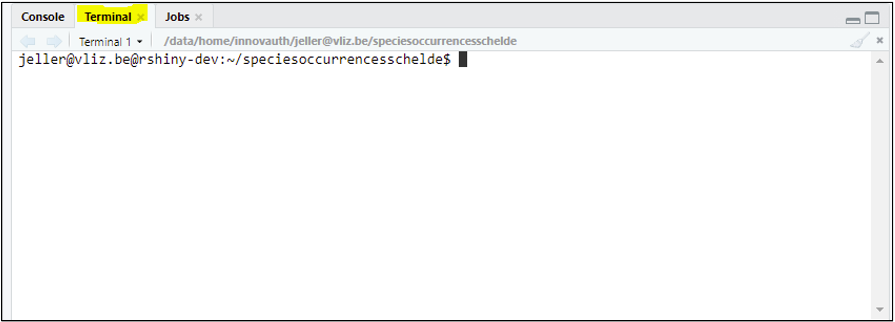
```

### Setting up a SSH key

1. Generate key pair

If users have never made a SSH key before within this RStudio environment, they need to run the **‘make-git-sshkey.sh’** script. This script will generate a standard named key pair to use for connecting to git services. 

To run, execute the following command in the terminal:

```{r eval=FALSE}
make-git-sshkey.sh
```

This will provide a message that the key pair was generated:

```{r echo=FALSE, out.width='80%'}
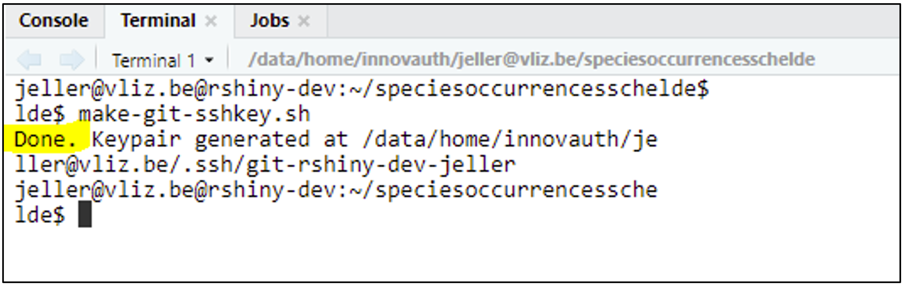
```

2. Register key pair

Next, the user will need to register the generated key pair on GitHub online. To do so, the script **‘connect-sshkey.sh’** can be used to correctly configure locally and advice the user towards how to publicly register the public part of the key at the service of the user’s choice (defaults to GitHub). 

To run, execute the following command in the terminal:

```{r eval=FALSE}
connect-sshkey.sh
```

This will provide an extensive message, detailing how to register the key on GitHub:

```{r echo=FALSE, out.width='80%'}
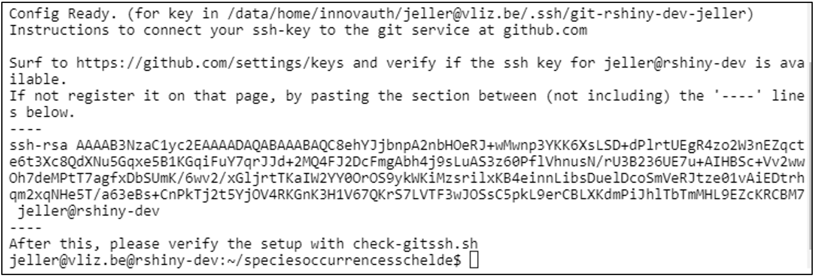
```

3. Copy key

As stated in the message, copy the text between the two ‘----‘. 

4. Add key to GitHub

Surf to https://github.com/settings/keys, and select the ‘New SSH key’ button in the upper right corner.

```{r echo=FALSE, out.width='80%'}
knitr::include_graphics("./images_manual_rstudio/image8d_github_new_sshkey.png")
```

This will open a new window with two text fields. In the ‘Key’ field, paste the text that you have copied from the RStudio terminal in step 3. 

Optionally, you can give a name to this key in the ‘Title’ field, applying to the RStudio environment in which you have created the key (best practices state that each environment has its own key).

When finished, press the ‘Add SSH key’ button. This will return you to the previous window, where you will see the new key added. 

```{r echo=FALSE, out.width='80%'}
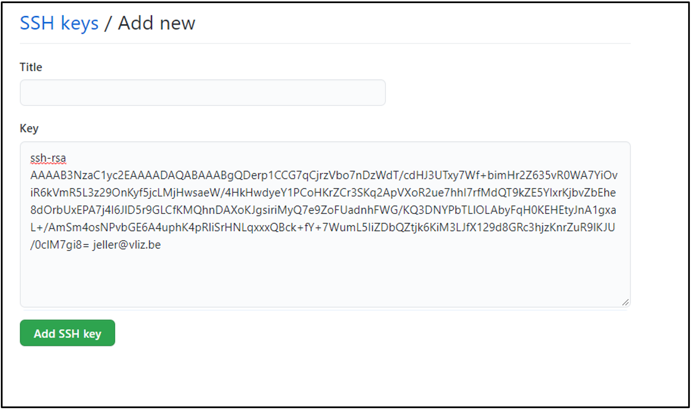
```

5. Verify SSH key

To verify if the previous steps were executed correctly, the script ‘check-gitssh.sh’ can be used. This script will check if the connection is set up correctly. This step can be done as often as needed or wanted. 

To run, execute the following command in the terminal of RStudio:

```{r eval=FALSE}
check-gitssh.sh
```

If done for the first time, the terminal might ask you to verify the action. To do this, type ‘yes’ behind the question mark and execute: 

```{r echo=FALSE, out.width='80%'}
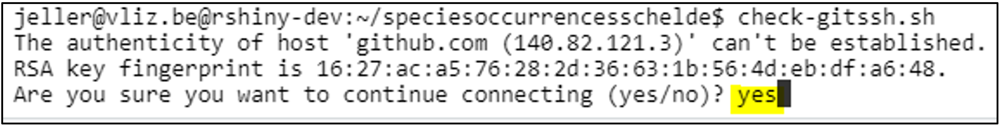
```

When everything was done correctly, the terminal will return the correct username:

```{r echo=FALSE, out.width='80%'}
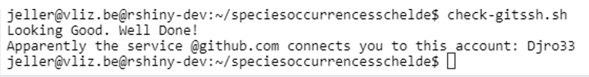
```

The workspace is now connected via SSH. The user can now start working through SSH in new projects or convert already connected projects to SSH. Both methods are explained in the following chapters. 

### Apply SSH authentication to new projects

From now on new projects should immediately start off by using the correct remote origin-url. The steps below explain how to do that.

1. Open the “File” menu and select “New Project”.

```{r, echo=FALSE, out.width='50%'}

```

2. In the New Project Wizard, select the option “Version Control”.

```{r echo=FALSE, out.width='60%'}

```

3. Next, select “Git” as this is the version controlled methodology used within the context of ScheldeMonitor.

```{r echo=FALSE, out.width='60%'}

```

4. Paste the URL of the repository in the ‘Repository URL’ field. In many cases, users paste the HTTPS URL of the repository. However, when using SSH authentication, the SSH URL needs to be pasted instead. This SSH URL can be found on the homescreen of the online repository, by selecting the green ‘Code’ button and the SSH option: 

```{r echo=FALSE, out.width='80%'}
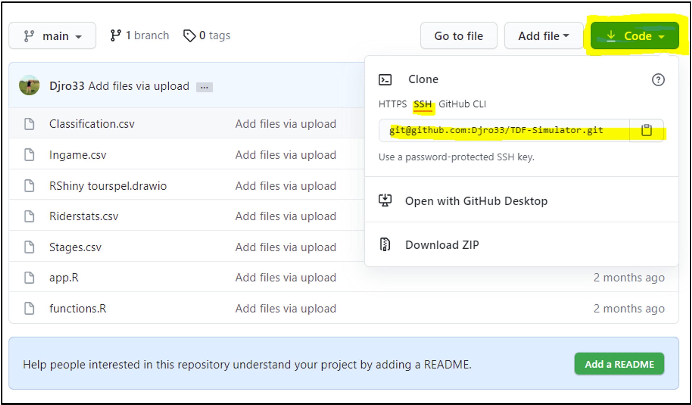
```

After choosing a name for your project locally, as well as a location, the project can be created. 

### Converting existing projects to SSH authentication

Projects were already connected to the RStudio workspace, before converting to SSH, will still work through HTTPS. To change this, open an existing project that you wish to convert in the RStudio environment. This can be done in the upper right corner of the screen: 

```{r echo=FALSE, out.width='40%'}
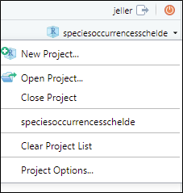
```

Once the project is opened, the script **‘fix-gitssh.sh’** can be used which will easily switch the connection to your project to git-ssh, and in the process figure out what service it is connected to. 

```{r eval=FALSE}
fix-gitssh.sh
```

The terminal should return the original connection, and a message that it is fixing the connection to git-ssh:

```{r echo=FALSE, out.width='90%'}
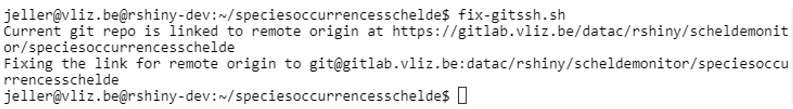
```

## Guidelines for scripts

A working directory or project in RStudio can hold a large number of scripts and files to work with. In order to keep the work organized, as well as reproductive over time, it’s important to structure these scripts both in the directory as well as internally. The segments below suggest guidelines that might aid researchers in keeping their work transparent for themselves and other users.

### Directory structure

A working directory or project is similar to any other folder on the local drive of your hardware. This implies that such a directory can consist of folders and subfolders. It is, however, imperative that folders are created following a certain structure or idea, to make the scripts and underlying data findable for yourself and other users. There are multiple levels on which a directory can be structured.

Firstly, if your work in RStudio is linked to a certain publication or report, your directory structure should mimic the same structure as the headings of the report. Here is an example from the T2015 report on the Scheldt, for which the project directory was structured conform the titles and subtitles within the published report:

```{r echo=FALSE}
knitr::include_graphics("./images_manual_rstudio/image9_directory_structure.png")
```

Yet, it is even more important to have a uniform structure at the lowest level of the working directory, where all files are stored. Especially for projects that are not linked to a fixed report, and for which the above-mentioned structure is not applicable.

Typically, data files and scripts should be saved in separate folders. Although it might seem more convenient to keep those files together, the general overview benefits from the two-folder structure. Scripts and data files often do not have a 1:1 relationship, as a single script can use multiple data files while these data files are run through multiple different scripts. However, the structure of each folder should be the same, with a folder for every phase of the project:

```{r echo=FALSE, out.width='50%'}
knitr::include_graphics("./images_manual_rstudio/image10_data-scripts_folder.png")
```

Using this structure, a uniform workflow can be established within the project directory. This workflow follows four steps, that are explained using the following table:

```{r workflow table, echo=FALSE}
data_workflowTable <- data.frame(
  Step = c("Step 1 - Import data (if necessary)", "Step 2 - Clean data", "Step 3 - Anayze data", "Step 4 - Create figures or results"),
  UsingDataFrom = c("n/a", "'a. Raw data'", "'b. Cleaned data'", "'c. Analyzed data'"),
  UsingScriptsOrFunctionFrom = c("'a. Import scripts'", "'b. Cleaning scripts'", "'c. Analysis scripts'", "'d. Figure scripts'"),
  SavingNewDataOrResultsIn = c("'a. Raw data'", "'b. Cleaned data'", "'c. Analyzed data'", "'d. Figures & Results'")
)
kable(data_workflowTable, col.names=c("", "Using data from:", "Using scripts or functions from:", "Saving new data or results in:"), align='l', booktaps=TRUE)%>%
  kable_styling(latex_options = "striped", full_width = FALSE, position = 'c')%>%
  column_spec(1, bold = TRUE)
```

It is possible that users rather run a single script to go through all these steps, especially in smaller projects. In this case, a ‘Main.R’ script can be saved alongside the ‘Data’ and ‘Scripts’ folders. This main script can then run through all these steps on its own, while sourcing different data files and functions from the underlying folder structure. The latter is especially important in larger projects, to ensure that the length and readability of the main scripts is optimal. When doing so, it is very important that the main script is well structured and annotated, as will be further explained in [Script structure](#script_structure) and [Script annotations](#script_annotations) below.

In any case, only one ‘main.R’ file should be present as to not create confusion.

### Script naming

Scripts should be named in such a way that users can easily derive its purpose, in order to not have to open all scripts in an RStudio environment to know what they are used for. This is especially important when working with a main script that sources functions from other scripts throughout the different phases.

For example, when using different scripts for different kind of graphs, the nomenclature should clearly indicate which plot is made using the script:

```{r echo=FALSE}
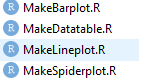
```

Additionally, if the work in the RStudio environment is linked to a certain report or publication, the figure number from the publication could be inserted in the file name:

```{r echo=FALSE}
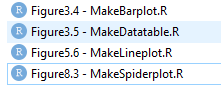
```

It is also possible that multiple scripts are used for the same figure, for instance if users want to be able to show both the original and the new plot on a later date. Still, the nomenclature needs to clearly indicate the discrepancies in the different scripts:

```{r echo=FALSE}
knitr::include_graphics("./images_manual_rstudio/image13_figure_script_naming2.png")
```

Nevertheless, whatever nomenclature is chosen, it should consist of a fixed and uniform naming convention. There are several options to choose from, similar to the ones available for code nomenclature as explained in [Naming conventions](#naming_conventions):

- alllowercase: e.g. makebarplot
- period.separated: e.g. make.barplot
- underscore_separated: e.g. make_barplot
- lowerCamelCase: e.g. makeBarPlot
- UpperCamelCase: e.g. MakeBarPlot

### Script structure

Similar to a directory, an individual script can greatly benefit from a fixed and uniform structure. This structure should clearly delineate the different sections in a script, which gives the reader a quick overview on the content, but also ensures the user that all actions and functions are run in a fixed order. Script structure can be accomplished almost immediately by using headings in the code. These are inserted in the same way as annotations are done. Ideally, all scripts should have the same headings to start with:

- Who, when, what and how: This is a large heading that should start every script in your project, stating who wrote the script, when it was written, how to contact the writer and what its purpose is.
- 0 – Load libraries: In this section all libraries are listed that need to be loaded before running the whole script. This section can also give some further explanation on the use of those libraries.
- 1 – Static part: In this part, all static actions are taken such as loading in data files, preparing those data files for analysis, sourcing other scripts and functions or naming arguments that will be used later on in the script.
- 2 – Script: This section contains the actual code that makes the script fulfill its purpose

```{r example1 script structure, eval=FALSE}
######################################################################
## This is an example for the manual
##
## written by Jelle Rondelez of VLIZ
## info@scheldemonitor.org - Oct 2020
######################################################################

##############################
# 0 - Load libraries
##############################
library(dplyr) # package to clean datatable
library(lubridate) # package to change date formats

##############################
# 1 - Static part
##############################

#Assign variable
newvar <- ""

#Source script from within directory
source("Script/a. Import scripts/ImportWFS")

#Open datafile
datafile <- read.csv(file = "Data/b. Cleaned data/dataRWS.csv")

##############################
# 2- Scripts
##############################
code...
```

Note that the sourced files in the example above are using the directory structure as described in [Directory structure](#directory_structure).

These headings not only give a fixed structure and order to all scripts in the project, it also has the added advantage that sections can be collapsed or expanded if needed. Especially for longer scripts, in which certain sections of the code are not of interest to the user, this can greatly increase the readability of the script:

```{r example1 script structure collapsed sections, eval=FALSE, include=FALSE}
######################################################################
## This is an example for the manual
##
## written by Jelle Rondelez of VLIZ
## info@scheldemonitor.org - Oct 2020
######################################################################

##############################
# 0 - Load libraries
##############################
library(dplyr) # package to clean datatable
library(lubridate) # package to change date formats

##############################
# 1 - Static part
##############################

#Assign variable
newvar <- ""

#Source script from within directory
source("Script/a. Import scripts/ImportWFS")

#Open datafile
datafile <- read.csv(file = "Data/b. Cleaned data/dataRWS.csv")

##############################
# 2- Scripts
##############################
code...
```

```{r echo=FALSE, out.width='70%'}
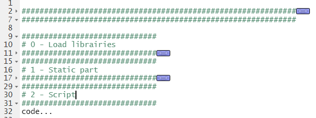
```

Larger scripts can benefit more from an expanded structure with additional headings. This is especially true for ‘main.R’ scripts that run through all phases of the project within a single script, as discussed in [Directory structure](#directory_structure). Those type of scripts typically source and use a multitude of different functions and files. An extended structure can make these scripts more readable and can make it easier to search for a specific function or action:

```{r example2 script structure, eval=FALSE}
######################################################################
## This is an example for the manual
##
## written by Jelle Rondelez of VLIZ
## info@scheldemonitor.org - Oct 2020
######################################################################

##############################
# 0 - Load libraries
##############################
library(dplyr) # package to clean datatable
library(lubridate) # package to change date formats

##############################
# 1 - Static part
##############################

#Assign variable
newvar <- ""

#Source script from within directory
source("Script/a. Import scripts/ImportWFS")

#Open datafile
datafile <- read.csv(file = "Data/b. Cleaned data/dataRWS.csv")

##############################
# 2- Scripts
##############################
code...

##############################
# 3 - Analysis part
##############################
code...

##############################
# 4 - Make plots & Figures
##############################
code...
```

### Script annotations

Annotating code is important for a number of reasons. The main reason is for the user personally when looking back on what was coded. It helps to explain in detail what a line, chunk or even section of code is trying to accomplish. This is also helpful for other people who read the code. Explaining what a line of code is doing can be useful for others who are looking to adapt work to their own, or when someone is checking or evaluating a chunk of code.
Annotating code is done with the symbol # (hashtag). Typically annotating can be done above a whole chunk of code, like when explaining the purpose of a certain function.

```{r example script annotation, eval=FALSE}
#Reactive values for user location
data_of_click <- reactiveValues(clicked = NULL)
longitude_click <- reactiveValues (lng = NULL)
latitude_click <- reactiveVaules (lat = NULL)

#If user clicks on map, new coordinates are saved and map is adjusted
observeEvent(input$Map_click. {
  data_of_click$clicked <- input$Map_click
  longitude_click <- input$Map_click$lng
  latitude_click <- input$Map_click$lat
  leafletProxy('Map')%>%
    clearMarkers()%>%
    addMarkers(lng = input$Map_click$lng,
              lat = input$Map_click$lat,
              popup = paste("Longitude=", round(input$Map_click$lng,2), "and", "Latittude=", round(input$Map_click$lat,2)))
})
```

## Guidelines for code

Unfortunately, unlike other programming languages, R has no widely accepted coding best practices. Instead there have been various attempts to put together a few sets of rules. This chapter tries to fill the gap by summarizing what was found relevant in those various attempts.

### Hardcoding

Calling to a file or folder from within a script is mostly done through ‘hardcoding’, e.g. giving the location of the file as a string. However, users are strongly recommended to keep the amount of hardcoding minimal, as it requires less effort to change a script when a directory location changes if less hardcoding is used. To do so, if your code will read in data from a file, define a variable early in the code that stores the path to that file. By doing so, the following example:

```{r example good hardcoding, eval=FALSE}
input_file <- "data/data.csv"
outpu_file <- "data/result.csv"

#read input
input_data <- read.csv(input_file)

#get number of samples in data
sample_number <- nrow(input_data)

#generate results
results <- some_other_function(input_file, sample_number)

#write results
write.table(results, output_file)
```

is preferable to:

```{r example bad hardcoding, eval=FALSE}
input_file <- "data/data.csv"
outpu_file <- "data/result.csv"

#read input
input_data <- read.csv("data/data.csv")

#get number of samples in data
sample_number <- nrow(input_data)

#generate results
results <- some_other_function("data/data.csv", sample_number)

#write results
write.table("data/results.csv", output_file)
```

### Naming conventions

R has no naming conventions for variables and functions that are generally agreed upon. As a newcomer to R it is useful to decide which naming convention to adopt. Generally, there are five naming conventions to choose from. It is important to pick one convention and stick to it for the remainder of your project:

- alllowercase: e.g. adjustcolor
- period.separated: e.g. plot.new
- underscore_separated: e.g. numeric_version
- lowerCamelCase: e.g. addTaskCallback
- UpperCamelCase: e.g. SignatureMethod

Above else, and besides the chosen naming convention, it is important to choose variable and function names that are concise and meaningful.

### Spacing

As with naming conventions, there are no syntax conventions when it comes to writing code in R. However, large scripts benefit greatly from the use of a clear and consistent syntax, as it makes the code more open and readable. Using correct spacing in your code makes an invaluable difference in the syntax. It can be implemented by following these rules:

- Always put a space after a comma, never before, just like in regular English.

```{r example spacings and comma, eval=FALSE}
# Good
x[, 1]

# Bad
x[,1]
x[ ,1]
x[ , 1]
```

- Do not put spaces inside or outside parentheses for regular function calls.

```{r example spacings and parentheses, eval=FALSE}
# Good
mean(x, na.rm = TRUE)

# Bad
mean (x, na.rm = TRUE)
mean( x, na.rm = TRUE )
```

- Place a space before and after () when used with if, for and while.

```{r example spacing and if for while, eval=FALSE}
# Good
if (debug) {
  show(x)
}

# Bad
if(debug){
  show(x)
}
```

- Place a space after () used for function arguments:

```{r example spacing and function arguments, eval=FALSE}
# Good
function(x) {}

# Bad
function (x) {}
function(x){}
```

- Most infix operators (==, +, -, <-, etc.) should always be surrounded by spaces:

```{r spacing and infix operators, eval=FALSE}
# Good
height <- (feet * 12) + inches
mean(x, na.rm = 10)

# Bad
height<-feet*12+inches
mean(x, na.rm=10)
```

However, it is important to not overdo spacing as well. Adding extra space can help, but only if it improves the alignment of = or <-. Do not add extra spaces to places where space is not helpful.

### Code blocks

Just as when talking about the overall structure of a script, hierarchy is equally important within the code itself. To define the most important hierarchies, curly braces are used. However, to keep the hierarchy transparent for yourself and other users, a consistent syntax is needed when using curly braces. This syntax is based on three rules:

- ‘{‘ should be the last character on the line. Related code (e.g. an if clause, a function declaration, a trailing comma, …) must be on the same line as the opening brace.
- The contents should be indented by two spaces.
- ‘}’ should be the first character on the line.

```{r example code blocks, eval=FALSE}
# Good
if (y < 0 && debug) {
  message("y is negative")
}

if (y == 0) {
  if (x > 0) {
    log(x)
  } else {
    message("x is negative or zero")
  }
} else {
  y^x
}
```

### Long lines of code

Users are recommended to always strive to limit the code to 80 characters per line. To do so, using a concise and efficient naming convention might already be an important step. If a function call is too long to fit on a single line, use one line each for the function name, each argument, and the closing bracket. This makes the code easier to read and to change later:

```{r example long line of code, eval=FALSE}
# Good
do_something_very_complicated(
  something = "that",
  requires = many,
  arguments = "some of which may be long"
)

# Bad
do_something_very_complicated("that", requires, many, arguments, "some of which may be long
)
```

### Pipes

Even when using correct spacing and adequate structuring of code blocks, a script can remain quite difficult to understand. This is especially true for scripts where a lot of different operations and functions are being used. When code is formed by a lot of functional language, it comes with a large number of parentheses and arguments per function. This can make code extremely complex and hard to understand.

To overcome this problem, users are recommended to using ‘piping’ for multiple actions on the same argument. Piping uses the ‘%>%’ operator and can be used by installing the ‘magrittr’ or ‘dplyr’ library. It is best explained through three simple rules:

- f(x) can be rewritten as x %>% f
- f(x, y) can be rewritten as x %>% f(y)
- h(g(f(x))) can be rewritten as x %>% f %>% g %>% h

```{r example piping, eval=FALSE}
#Import 'dyplr' library
library(dyplr)

#Load the data
data(babynames)

#Count how many young boys with the name "Taylor" are born
sum(select(filter(babynames, sex=="M", name=="Taylor"), n ))

#Do the same but now with '%>%'
babaynames%>%filter(sex=="M", name=="Taylor")%>%
  select(n)%>%
  sum
```

### Tidyverse style duide & add-ons

The R-community has multiple guides on how to style and manage your code in order to make it readable and clean. All these style guides are however fundamentally opinionated. Some decisions genuinely do make code easier to use, but many decisions are arbitrary. The most important thing about a style guide is that it provides consistency, making code easier to write because you need to make fewer decisions.

Users of the RStudio environment of ScheldeMonitor are recommended to use the [tidyverse style guide](https://style.tidyverse.org), as it is one of the most commonly used guides. The rules mentioned above in this manual are also part of the tidyverse style guide.

There are two tools that can be installed by users that make it easier to implement this style guide, the ‘styler’ and ‘lintr’ packages. The installation of the 'tidyverse' package is not needed for these applications. The 'styler' and 'lintr' packages can be installed with the following R code:

```{r install styler and lintr, eval=FALSE}
#Install packages 'styler' and 'lintr'
install.packages("styler")
install.packages("lintr")
```

- The ‘styler’ package allows to interactively restyle selected text, files or entire projects. It includes an RStudio add-in, the easiest way to restyle the existing code.

```{r echo=FALSE, out.width='50%'}
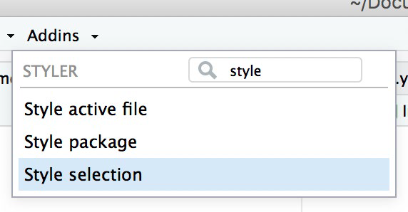
```

- The ‘lintr’ package can perform automated checks to confirm that code is conform the style guide. This check is automatically displayed in the RStudio ‘Markers pane’. To show this pane, go the “Tools” Menu and select “Global Options…”. A window with title “Options” will pop up. In that window: Select “Code” on the left; Select “Diagnostics” tab; Check “Show diagnostics for R”.

The following window will now be visible:

```{r echo=FALSE, out_width='80%'}
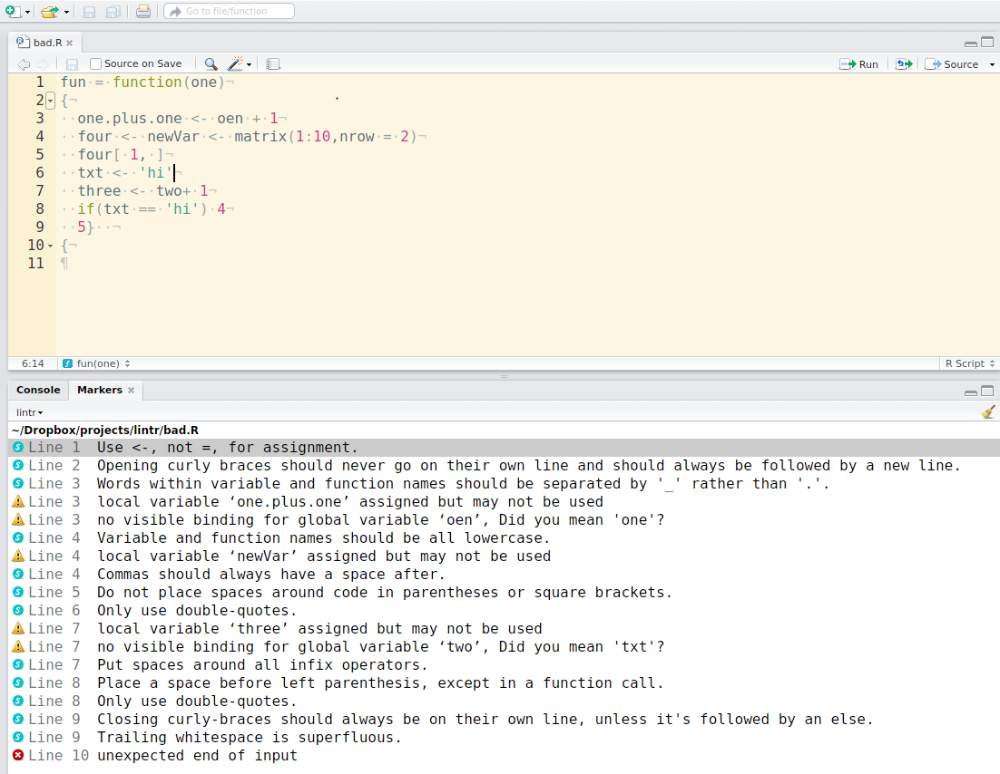
```

It is recommended to use the 'styler' package first, followed by the 'lintr' package. Because the 'styler' package automatically corrects style errors such as the incorrect use of spaces and commas. Hence, the list of errors, that need to be manually corrected, generated by the 'lintr' package is shorter.

# Using data from ScheldeMonitor in RStudio

Most of the data in ScheldeMonitor can be used freely, and users are encouraged to use the RStudio environment of ScheldeMonitor to further analyse and validate our data collection. To do so, the data needs to be loaded into the RStudio environment first. This can be done either by loading downloaded data files such as CSV or TXT, or by using the generic webservices of ScheldeMonitor. Both methods involve accessing the [Data Download Toolbox](https://www.scheldemonitor.org/dataproducts/nl/download/) of ScheldeMonitor, which can be done using the following steps:

1. Go to the home screen of the toolbox and choose between biotic and abiotic data.

```{r, echo=FALSE, out.width='90%'}
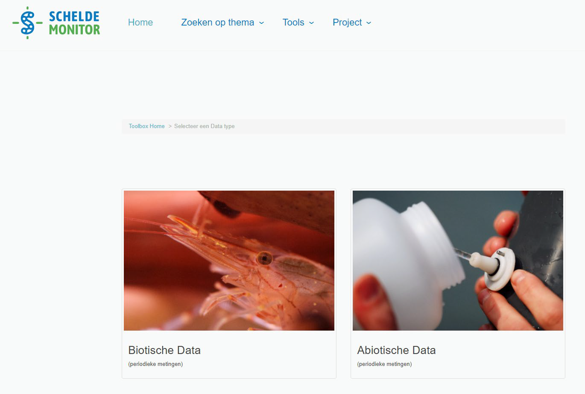
```

2. The toolbox offers several criteria to filter the database of ScheldeMonitor. These criteria differ for biotic and abiotic data. In the explore tab you can select data based on the datasource, geographical area, or time period. Details about the content of the dataset are accessible with the “more info” button (information sign) on the right of the dataset name.

```{r echo=FALSE, out.width='90%'}
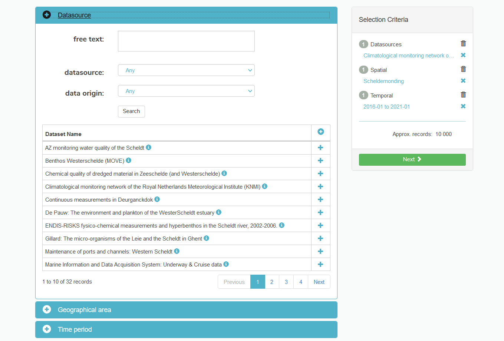
```

It is not mandatory to select a datasource, geographical area or time period in the explore tab. In the next tab (accessible via the green “next” button) a specific taxon (biotic data) or parameter (abiotic data) can be selected.Dataset, parameters, or taxa can be added to your selection with the plus sign on the right of the dataset, parameter, or taxon.

When criteria are selected, the counter on the right side of the screen shows the remaining number of records that match the chosen criteria.

```{r echo=FALSE, out.width='90%'}
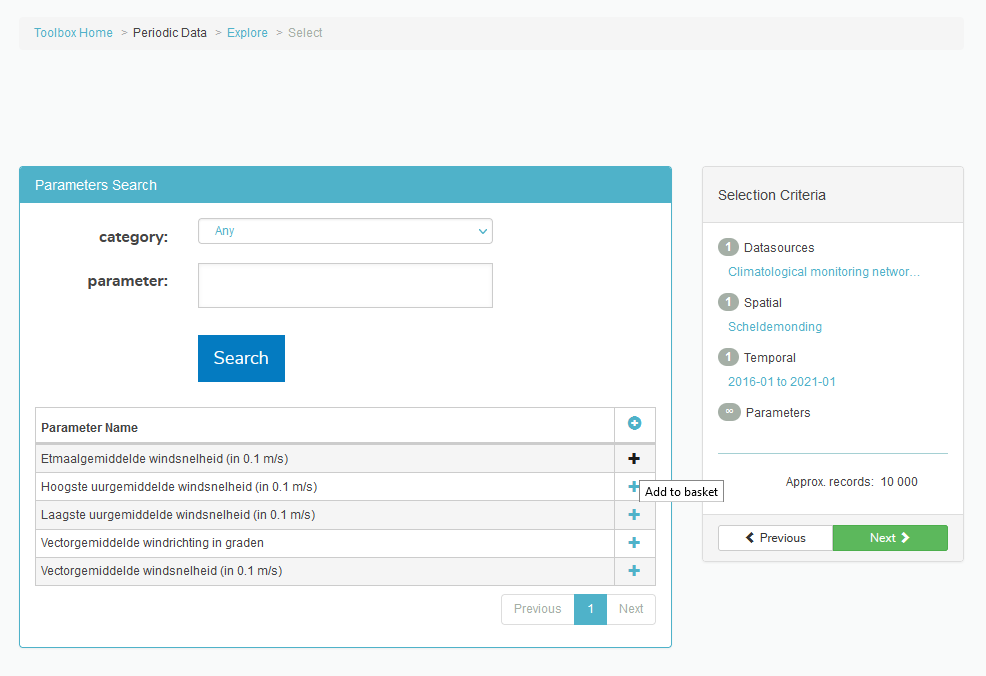
```

3. Once all desired criteria are selected, select the green “Next” button to view a data summary of your data in the toolbox.

```{r echo=FALSE, out.width='90%'}
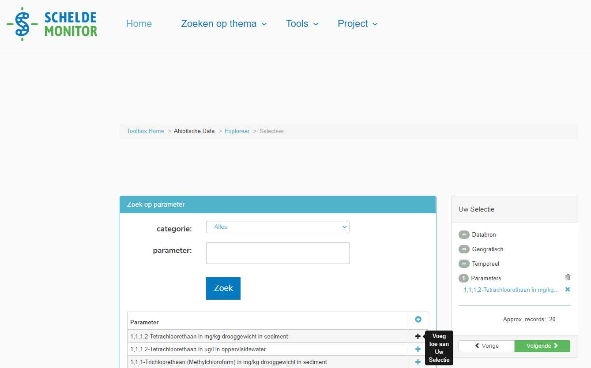
```

4. The toolbox shows a summary of the chosen data set, along with several options to download or visualize the data. The following actions can be taken in the toolbox:

    - _Download Data_: a data file in csv-format will be downloaded. More detailed information is available in the segment [‘A: Using data from download data files’](#using_data_from_downloaded_data_files).
    - _View on Map_: visualizes the data in a dynamic map viewer.
    - _Upload to MDA_: saves your specific data selection to the Marine Data Archive, so that this selection becomes reusable on a later date.
    - _Save selection_: saves a JSON file describing your specific data selection.
    - _Share_: creates a URL link of your selection
    - _Webservice URL_: generates a WFS url (Web Feature Service) that can be used to automatically load the data in a script or medium. More detailed information is available in the segment [‘B: Using data from generic webservices’](#using_data_from_generic_webservices).
    - _Load selection_: loads in a previously saved data selection using a JSON file.


```{r echo=FALSE, out.width='90%'}
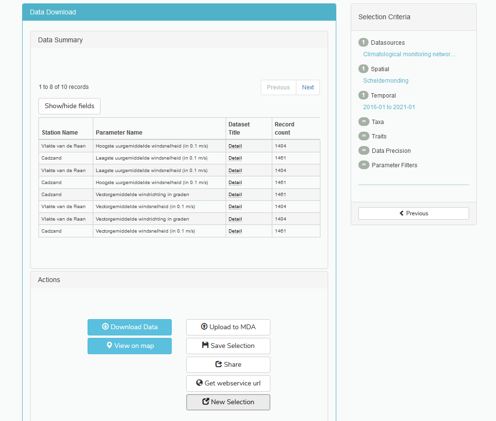
```

5. Most, but not all data in ScheldeMonitor is public. Some data are only visible for users with appropriate credentials. For these data sets, no values will be given when downloading the data using both data files and webservices. Therefore, the toolbox provides a “Login” button in the upper right corner. This button will take users to a login screen where credentials can be entered or requested. After successful login, return to the toolbox. All values will now be visible upon downloading the data set.

```{r echo=FALSE, out.width='50%'}
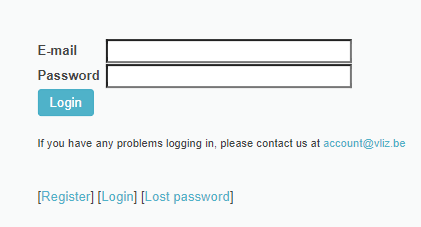
```

## Using data from download data files

Users can now choose to download the data from the ScheldeMonitor toolbox as data files in a CSV file format. To do so, and to use them in the RStudio environment, the user can perform the following steps:

1. The user selects the “Download Data” button and submits all necessary information to commence his/her download:

    - Organization: Select the type of organization you work for. This is not mandatory.
    - Email: Provide the toolbox with an email address to which a notification can be send on the readiness of your download.
    - Country: Select the country from which the download is done.
    - Data purpose: Select for which purpose the download is done.

```{r echo=FALSE, out.width='80%'}
knitr::include_graphics("./images_manual_rstudio/image20_scheldemonitor_data_download_justification.png")
```

2. After the necessary information has been submitted, your data will be prepared for download. This preparation can be followed in the upper right corner of the screen. After the preparation is done, a button will be provided by which the download can begin. For large data files, a mail can be sent to a given address to notify a user that the download is fully prepared.

```{r echo=FALSE, out.width='80%'}
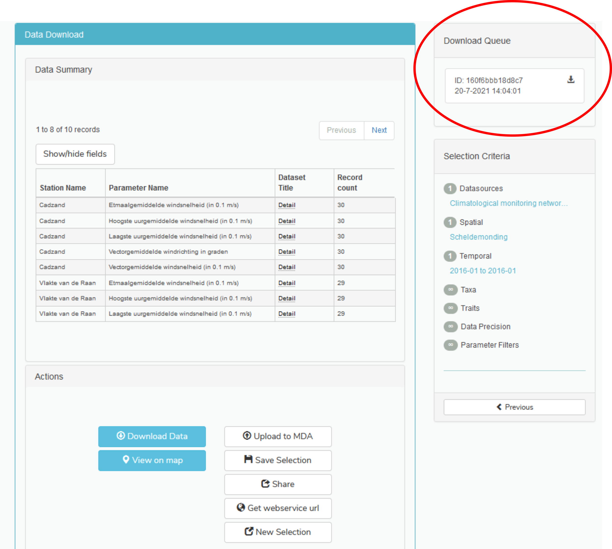
```

3. Once the data file is saved on the local drive, the user can load it into the RStudio environment to start working with the data. This can be done by using the basic package of R, by running the following function:

```{r load data into RStudio, eval=FALSE}
data = read.csv("paht/file.csv", stringsAsFactors = FALSE)
```

For example:

```{r example loading data into RStudio, eval=FALSE}
data_waterstand = read.csv("Data/hoogwater_combinded.csv", stringsAsFactors = FALSE)
```

4. CSV is the only format in which the data files can be downloaded. This format does however have a limit of 1.000.000 records. Larger files will lose records when a user wants to open them in MS Excel before loading them in R. Therefore, users are recommended to open these larger data files as a TXT file, in programs like Notepad++.

## Using data from generic webservices

However, users of the RStudio environment of ScheldeMonitor are urged to make use of the generic webservices that are available in the data download toolbox of ScheldeMonitor. These webservices are a URL format that automatically queries the ScheldeMonitor database without human intervention. The composition of this URL is automatically generated, based on the selection made by the user in the criteria of the data download toolbox. Using webservices has the added advantage that no data files are needed to load in the data set in R, and that the most
recent version of the database is queried. The latter implies that when new data is added in the database to an already downloaded data set, the same webservice URL will be able to automatically load in the newly added data. To use the webservices in the RStudio environment:

1. Select the “Webservice URL” option in the data download toolbox, which will give you the URL that is to be used to acquire the selected data set.

```{r, echo=FALSE, out.width = '80%'}
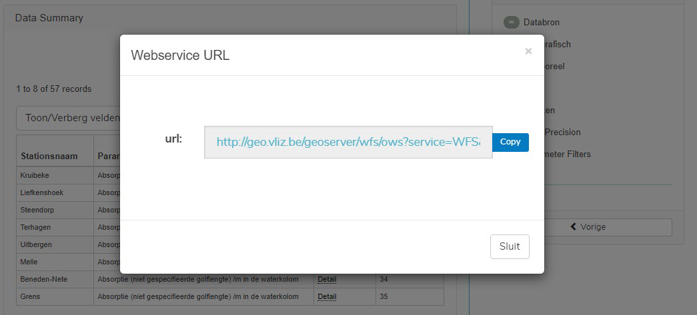
```

2. Once you copied the entire URL, you can use it to load your data into the RStudio environment. Therefore you can use a function in the R-library ‘sf’ and the following lines of code:

```{r load webservice into RStudio, eval=FALSE}
install.packages("sf")
library(sf)
webservice <- "URL"
data <- data.frame(st_read(webservice))
```

3. Depending on the size of the requested data set, loading the data in R can take up to a minute. Nevertheless, the data set will be available in the environment of the RStudio. The limit of the webservice is capped at around 1.000.000 records per request. Therefore, it is recommended that users generate multiple separate URL’s in the toolbox if they want to analyze more than a million records, and merge the data set in R itself.

4. VLIZ has made a script read data for a given time period (one year) for a given parameter. This script can be found below or on the [ScheldeMonitor](https://github.com/scheldemonitor) GitHub page. How to access the ScheldeMonitor GitHub organization is described in a dedicated [manual](https://www.scheldemonitor.org/sites/scheldemonitor.be/files/2021-07/manual-github.pdf) on the use of GitHub, available on the [website](https://www.scheldemonitor.org/en/data-analysis-platform).

```{r, eval=FALSE}
#Created by Jelle Rondelez (VLIZ) on 8/3/21

#These packages are needed
install.packages(sf)
install.packages(stringr)
install.packages(dplyr)
library(dplyr)
library(sf)
library(stringr)

dataset <- data.frame()

#Here, the years for which you want to download data should be listed.
#Using the for loop, data can be downloaded per year by default
years <- c("2016","2017","2018","2019","2020","2021")

#This is a test string. Replace it with your own string
#The timespan of the original wfs string should run from 1 Jan tot 31 Dec, no matter which years are selected
wfsstring <- "http://geo.vliz.be/geoserver/wfs/ows?service=WFS&version=1.1.0&request=GetFeature&typeName=Dataportal%3Aabiotic_observations&resultType=results&viewParams=where%3Aobs.context+%26%26+ARRAY%5B1%5D+AND+standardparameterid+IN+%281073%29+AND+%28%28datetime_search+BETWEEN+%272016-01-01%27+AND+%272021-12-31%27+%29%29%3Bcontext%3A0001&propertyName=stationname%2Clongitude%2Clatitude%2Cdatetime%2Cdepth%2Cparametername%2Cvaluesign%2Cvalue%2Cdataprovider%2Cdatasettitle&outputFormat=csv"

#This for loop results in the download of yearly datasets.
#At the end of the loop, all datasets are both saved seperately and appended together.
#If the user wants to download in larger timespans, change the second 'years[i]'
#example: 'years[i+1] downloads data for two year spans

for (i in 1:length(years)) {
  wfsstring <- str_replace(wfsstring,"(?<=%27).*(?=-12-31)",paste(years[i],"-01-01%27+AND+%27",years[i],sep=""))
  name <- paste(years[i])
  data <- data.frame(st_read(wfsstring))
  dataset <- rbind(data,dataset)
  assign(name,data)
}
```

# Helpdesk

VLIZ is responsible to keep the RStudio environment of ScheldeMonitor up and running. Besides foreseeing the necessary server and memory capacity, VLIZ will thus also make sure that all necessary R libraries and packages are installed on the RStudio server. If new libraries and packages need to be installed, users can contact VLIZ to do so.

To accommodate these and other needs of users and contributors, VLIZ will have a permanent helpdesk. This helpdesk can be contacted through the general address of the ScheldeMonitor:

**Helpdesk ScheldeMonitor**

Data Centre - Local Services & Projects

:::: {class="flex-container"}

::: {class="flex-image-item"}

```{r, echo=FALSE}
knitr::include_graphics("./images_manual_rstudio/VLIZ_logo_positief.png")
```

:::

::: {class="flex-text-item"}

**Vlaams Instituut voor de Zee vzw**

**Flanders Marine Institute**

InnovOcean site, Wandelaarkaai 7

8400 Oostende, Belgium

:::

::: {class="flex-text-item"}

T +32(0)59340172

info@scheldemonitor.org

[www.vliz.be](www.vliz.be)

:::

::::

For urgent matters or questions, or if users and contributors want to discuss the use of the RStudio environment for certain projects, the project manager of ScheldeMonitor should be contacted:

**Jelle Rondelez**

::: {class="no-spacing"}

Project Manager

Data Centre - Local Services & Projects

:::

:::: {class="flex-container"}

::: {class="flex-image-item"}

```{r, echo=FALSE}
knitr::include_graphics("./images_manual_rstudio/VLIZ_logo_positief.png")
```

:::

::: {class="flex-text-item"}

**Vlaams Instituut voor de Zee vzw**

**Flanders Marine Institute**

InnovOcean site, Wandelaarkaai 7

8400 Oostende, Belgium

:::

::: {class="flex-text-item"}

M +32(0)473510828

jelle.rondelez@vliz.be

[www.vliz.be](www.vliz.be)

:::

::::
